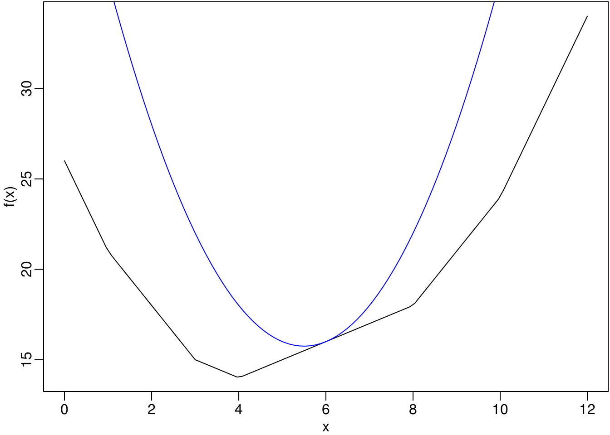

# Optimization {#optim}

Recall the MLE example in Chapter \@ref(prelim). Consider a random sample $X_1, \ldots, X_n$ of size $n$ coming from a univariate distribution with density function $f(x | \theta)$, where $\theta$ is a parameter vector. The MLE $\hat\theta_n$ of the unknown parameter $\theta$ is obtained by maximizing the loglikelihood function
\[
l(\theta) = \sum_{i=1}^n \log f(X_i | \theta)
\]
with respect to $\theta$.
Typically, $\hat\theta$ is obtained by solving the score equation
\[
l'(\theta) = \sum_{i=1}^n \frac{\partial}{\partial \theta}
\log f(X_i; \theta) = 0,
\]
i.e., the derivative of the loglikelihood function equated to zero.
From mathematical statistics, it is known that, under certain regularity
conditions,
\begin{align*}
\E \frac{\partial}{\partial \theta} \log f(X; \theta) &= 0,\\
\E \frac{\partial}{\partial \theta} \log f(X; \theta)
\left[\frac{\partial}{\partial \theta} \log f(X; \theta) \right]^{\top} 
&= - \E
\frac{\partial^2}{\partial \theta \partial \theta^{\top}} \log f(X; \theta).
\end{align*}
The expectation in the second equation is known as the Fisher information
$I(\theta)$, a nonnegative definite matrix. Large sample results state that,
as $n \to \infty$, $\hat\theta_n$ is consistent for $\theta$ and
$\sqrt{n} (\hat\theta_n - \theta)$ converges in distribution to
$N(0, I^{-1}(\theta))$. The asymptotic variance of $\hat\theta$ can be estimated by inverting the observed Fisher information matrix $l''(\hat\theta_n)$.


More generally in Statistics, M-estimators are a broad class of extremum estimators obtained by maximizing an data dependent objective function. Both non-linear least squares and maximum likelihood estimation are special cases of M-estimators. The definition of M-estimators was motivated by robust statistics, which contributed new types of M-estimators. When the objective function is smooth, the M-estimator can be obtained by solving the corresponding "score" equation. Clearly, optimization or root-finding are very important in Statistics.


## Univariate Optimizations

Optimization and root finding are closely related. Consider maximization of a smooth and differentiable function $g(x)$. A necessary condition at the maximum is $f(x) = g'(x) = 0$. Univariate illustrations help to gain insights about the ideas.

### Bisection Method

The bisection method repeatedly bisects an interval and then selects a subinterval in which a root must lie for further processing. It is a very simple and robust method, but relatively slow. 


The method is applicable for solving the equation $f(x) = 0$ for the real variable $x$, where $f$ is a continuous function defined on an interval $[a, b]$ and $f(a)$ and $f(b)$ have opposite signs. This method is illustrated with an animation using the package **animation** [@R-animation].


```r
animation::bisection.method()
```

### Newton's Method
A fast approach to find roots of a differentiable function $f(x)$. The methods starts from some initial value $x_0$, and for $t = 0, 1, \ldots$, compute 
\begin{align*}
  x_{t+1} = x_t  - \frac{f(x_t)}{f'(x_t)}
\end{align*}
until $x_t$ converges. The method is based on a linear expansion of $f(x)$. The method is also known as Newton--Raphson iteration. It needs an initial value $x_0$. If $f(x) = 0$ has multiple solutions, the end result depends on $x_0$.

Applied to optimization of $g$, this method requires the Hessian $g''$,
which can be difficult to obtain, especially for multivariate functions.
Many variants of Newton's method avoid the computation of the Hessian.


For example, to obtain MLE with likelihood $l(\theta)$, Fisher scoring replaces $-l''(\theta_t)$ with $I(\theta_t)$. Generally, one uses Fisher scoring in the beginning to make rapid improvements, and Newton's method for refinement near the end.


The secant method approximates $f'(x_t)$ by
\begin{align*}
  \frac{f(x_t) - f(x_{t-1})}{x_t - x_{t-1}}.
\end{align*}
Given initial values $x_0$ and $x_1$, the iteration is
\begin{align*}
  x_{t+1} = x_t - \frac{f(x_t)(x_t- x_{t-1})}{f(x_t) - f(x_{t-1})}.
\end{align*}

### Fixed Point Iteration

A fixed point of a function is a point whose evaluation by that 
function equals to itself, i.e., $x = G(x)$.

Fixed point iteration: the natural way of hunting for a fixed point 
is to use $x_{t+1} = G(x_t)$.

\BeginKnitrBlock{definition}<div class="definition"><span class="definition" id="def:contractive"><strong>(\#def:contractive) </strong></span>A function $G$ is contractive on $[a,b]$ if
\begin{align*}
  (1).\,\, & G(x)\in [a,b] \mbox{ whenever } x\in [a,b],\\
  (2).\,\, & |G(x_1) - G(x_2)| \leq \lambda |x_1-x_2| \mbox{ for all } x_1,x_2\in [a,b] \mbox{ and some } \lambda\in [0,1).
\end{align*}</div>\EndKnitrBlock{definition}

\BeginKnitrBlock{theorem}<div class="theorem"><span class="theorem" id="thm:fixedPoint"><strong>(\#thm:fixedPoint) </strong></span>If $G$ is contractive on $[a,b]$, then there is a unique fixed point $x^*\in [a,b]$, and the fixed point iteration convergence to it when starting inside the interval.</div>\EndKnitrBlock{theorem}

Convergence: $|x_{t+1}-x_{t}|=|G(x_t)-G(x_{t-1})|\leq \lambda |x_t - x_{t-1}|\leq \lambda^{t}|x_1-x_0| \rightarrow 0$, as $t\rightarrow \infty$. It follows that $\{x_t\}$ convergent to a limit $x^*$.


Application in root finding: for solving $f(x)=0$, we can simply let $G(x) = x + \alpha f(x)$, where $\alpha \neq 0$ is a constant.

Required Lipschitz condition: $|x - y + \alpha [f(x) - f(y)]| \le \lambda|x-y|$, for some $\lambda \in [0,1)$ and for all $x,y\in [a,b]$. This holds if $|G'(x)|\leq \lambda$ for some $\lambda \in [0,1)$ and for all $x\in [a,b]$, i.e., $|1+\alpha f'(x)|\leq\lambda$. (use mean value theorem.)


Newton's methods: $G(x) = x - f(x)/f'(x)$. So it is as if $\alpha_t$ is chosen adaptively as $\alpha_t=-1/f'(x_t)$. This leads to a faster convergence order (quadratic).

## Multivariate Optimization
Consider maximizing a real-valued objective function $g(x)$ of $p$-dimensional vector $x$.

### Newton-Raphson Method

The Newton-Raphson method is a generalization of univariate Newton's root finding algorithm to the multivariate case.

### Variants of Newton-Raphson Method

The motivation is to avoid the calculation of the Hessian matrix in updatings with the form
\[
x^{(t + 1)} = x^{(t)} - (M^{(t)})^{-1} g'(x),
\]
where $g'$ is the gradient of $g$ and $M$ is a substitute of $g''(x)$.

#### Fisher Scoring

Choose $M$ as the negative Fisher information matrix. For location-families, it can be shown that the information matrix is free of the location parameter.

#### Steepest Ascent

Choose $M = \alpha^{(t)} I_p$ for $\alpha^{(t)} > 0$ so the updating in the direction of he steepest ascent.

#### Discrete Newton

Approximate the Hessian matrix with finite-difference quotients.

#### Fixed-Point Iteration

Choose $M^{(t)} = M$ for all $t$. An example is $M = g''(x_0)$.

#### Quasi-Newton

Quasi-Newton methods avoids Hessian matrix by constructing approximations of
the inverse Hessian. The inverse Hessian is built up from gradient information obtained at various points.


Rank-two update. The celebrated BFGS is a rank-two update method. Box constraints can be allowed with L-BFGS-B.

#### Coordinate Descent

Coordinate descent algorithms optimize a objective function with 
respect to a single parameter or a block of parameters at a time, 
iteratively cycling through all parameters until convergence is reached.
How to determine the blocks of parameters is problem-specific.
The method is ideal for problems that have a simple closed form 
solution in a single/lower dimension but lack one in higher dimensions.
% The method is also called backfitting or Gauss--Seidel iteration.
It is very commonly used in fitting penalized regression.
The concept also appears in many well-known estimation problems.
The simple technique can be surprisingly efficient and scalable.


Consider objective function
\[
f(\beta) = g(\beta) + \sum_{j=1}^{p}h_j(\beta_j),
\]
where $g$ is convex and differentiable and each $h_i$ is convex.
The second part is usually non-smooth, but is separable.
Coordinate descent start with some initial guess $\beta^{(0)}$, repeat 
the following for $k=1,2,3...$:
\begin{align*}
  \beta_1^{(k)} & = \arg\min_{\beta_1}f(\beta_1,\beta_2^{(k-1)},\ldots,\beta_p^{(k-1)}),\\
  \beta_2^{(k)} & = \arg\min_{\beta_2}f(\beta_1^{(k)},\beta_2, \beta_3^{(k-1)},\ldots,\beta_p^{(k-1)}),\\
  & \ldots\\
  \beta_p^{(k)} & = \arg\min_{\beta_p}f(\beta_1^{(k)},\ldots,\beta_{p-1}^{(k)},\beta_p).
\end{align*}
It can be shown that if we are at a point $\beta$ such that $f(\beta)$ 
is minimized along each coordinate axis, we have found a global minimizer.


Remarks:

- Order of cycle through coordinates is arbitrary.
- Can replace individual coordinates with blocks of coordinates.
- Same idea has been applied to many non-convex problems.
- As long as the objective function is monotone decreasing, the convergence is guaranteed.


#### Conjugate Gradient

#### Gauss-Newton

Non-linear least squares.

### Nelder-Mead (Simplex) Algorithm

Not even the gradient is needed. 
Possible moves are: reflection; expansion; outer contraction; inner contraction; shrinkage.


Consider minimizing this simple function.

```r
f1 <- function(x) {
  x1 <- x[1]
  x2 <- x[2]
  x1^2 + 3*x2^2  
}
```
Apparently the minimizer is $(0, 0)$. Let's track all the points at which the function is evaluated in the Nelder-Mead algorithm.

```r
trace(f1, exit = quote(print(c(returnValue(), x))))
```

```
## [1] "f1"
```

```r
optim(c(1, 1), f1, control = list(trace = TRUE))
```

```
##   Nelder-Mead direct search function minimizer
## Tracing fn(par, ...) on exit 
## [1] 4 1 1
## function value for initial parameters = 4.000000
##   Scaled convergence tolerance is 5.96046e-08
## Stepsize computed as 0.100000
## Tracing fn(par, ...) on exit 
## [1] 4.21 1.10 1.00
## Tracing fn(par, ...) on exit 
## [1] 4.63 1.00 1.10
## BUILD              3 4.630000 4.000000
## Tracing fn(par, ...) on exit 
## [1] 3.64 1.10 0.90
## Tracing fn(par, ...) on exit 
## [1] 3.2425 1.1500 0.8000
## EXTENSION          5 4.210000 3.242500
## Tracing fn(par, ...) on exit 
## [1] 3.0225 1.0500 0.8000
## Tracing fn(par, ...) on exit 
## [1] 2.520625 1.025000 0.700000
## EXTENSION          7 4.000000 2.520625
## Tracing fn(par, ...) on exit 
## [1] 2.130625 1.175000 0.500000
## Tracing fn(par, ...) on exit 
## [1] 1.781406 1.262500 0.250000
## EXTENSION          9 3.242500 1.781406
## Tracing fn(par, ...) on exit 
## [1] 1.361406 1.137500 0.150000
## Tracing fn(par, ...) on exit 
## [1]  1.371602  1.131250 -0.175000
## REFLECTION        11 2.520625 1.361406
## Tracing fn(par, ...) on exit 
## [1]  2.160625  1.375000 -0.300000
## Tracing fn(par, ...) on exit 
## [1]  1.665156  1.287500 -0.050000
## LO-REDUCTION      13 1.781406 1.361406
## Tracing fn(par, ...) on exit 
## [1]  1.418906  1.162500 -0.150000
## Tracing fn(par, ...) on exit 
## [1]  1.417656  1.187500 -0.050000
## LO-REDUCTION      15 1.665156 1.361406
## Tracing fn(par, ...) on exit 
## [1] 1.143906 1.037500 0.150000
## Tracing fn(par, ...) on exit 
## [1] 1.020156 0.912500 0.250000
## EXTENSION         17 1.417656 1.020156
## Tracing fn(par, ...) on exit 
## [1] 1.351406 0.862500 0.450000
## Tracing fn(par, ...) on exit 
## [1] 1.207539 0.943750 0.325000
## LO-REDUCTION      19 1.361406 1.020156
## Tracing fn(par, ...) on exit 
## [1] 1.058477 0.718750 0.425000
## Tracing fn(par, ...) on exit 
## [1] 1.0587915 0.8234375 0.3562500
## LO-REDUCTION      21 1.207539 1.020156
## Tracing fn(par, ...) on exit 
## [1] 0.8401563 0.6875000 0.3500000
## Tracing fn(par, ...) on exit 
## [1] 0.7071191 0.5593750 0.3625000
## EXTENSION         23 1.058477 0.707119
## Tracing fn(par, ...) on exit 
## [1] 0.672666 0.753125 0.187500
## Tracing fn(par, ...) on exit 
## [1] 0.6075610 0.7703125 0.0687500
## EXTENSION         25 1.020156 0.607561
## Tracing fn(par, ...) on exit 
## [1] 0.2726001 0.4171875 0.1812500
## Tracing fn(par, ...) on exit 
## [1] 0.09345764 0.16953125 0.14687500
## EXTENSION         27 0.707119 0.093458
## Tracing fn(par, ...) on exit 
## [1]  0.2094733  0.3804688 -0.1468750
## Tracing fn(par, ...) on exit 
## [1]  0.18193546  0.42519531 -0.01953125
## LO-REDUCTION      29 0.607561 0.093458
## Tracing fn(par, ...) on exit 
## [1]  0.04113010 -0.17558594  0.05859375
## Tracing fn(par, ...) on exit 
## [1]  0.42918962 -0.64853516  0.05351562
## REFLECTION        31 0.181935 0.041130
## Tracing fn(par, ...) on exit 
## [1]  0.3378516 -0.4312500  0.2250000
## Tracing fn(par, ...) on exit 
## [1] 0.04974852 0.21108398 0.04160156
## HI-REDUCTION      33 0.093458 0.041130
## Tracing fn(par, ...) on exit 
## [1]  0.02450188 -0.13403320 -0.04667969
## Tracing fn(par, ...) on exit 
## [1]  0.1434302 -0.2858154 -0.1434570
## REFLECTION        35 0.049749 0.024502
## Tracing fn(par, ...) on exit 
## [1]  0.2737758 -0.5207031 -0.0296875
## Tracing fn(par, ...) on exit 
## [1] 0.002488067 0.028137207 0.023779297
## HI-REDUCTION      37 0.041130 0.002488
## Tracing fn(par, ...) on exit 
## [1]  0.02478057  0.06968994 -0.08149414
## Tracing fn(par, ...) on exit 
## [1]  0.006549060  0.008370972 -0.046472168
## LO-REDUCTION      39 0.024502 0.002488
## Tracing fn(par, ...) on exit 
## [1] 0.03081047 0.17054138 0.02398682
## Tracing fn(par, ...) on exit 
## [1]  0.005876474 -0.057889557 -0.029013062
## HI-REDUCTION      41 0.006549 0.002488
## Tracing fn(par, ...) on exit 
## [1]  0.006555205 -0.038123322  0.041238403
## Tracing fn(par, ...) on exit 
## [1]  0.001817881 -0.003252602 -0.024544525
## HI-REDUCTION      43 0.005876 0.001818
## Tracing fn(par, ...) on exit 
## [1] 0.009245382 0.082774162 0.028247833
## Tracing fn(par, ...) on exit 
## [1]  0.001164443 -0.022723627 -0.014697838
## HI-REDUCTION      45 0.002488 0.001164
## Tracing fn(par, ...) on exit 
## [1]  0.01484345 -0.05411344 -0.06302166
## Tracing fn(par, ...) on exit 
## [1] 7.034119e-05 7.574546e-03 2.079058e-03
## HI-REDUCTION      47 0.001818 0.000070
## Tracing fn(par, ...) on exit 
## [1]  0.0005681964 -0.0118964791  0.0119257450
## Tracing fn(par, ...) on exit 
## [1]  0.0001184377 -0.0097355098  0.0028081775
## LO-REDUCTION      49 0.001164 0.000070
## Tracing fn(par, ...) on exit 
## [1] 0.001573548 0.020562664 0.019585073
## Tracing fn(par, ...) on exit 
## [1]  0.0002542833 -0.0119020544 -0.0061271101
## HI-REDUCTION      51 0.000254 0.000070
## Tracing fn(par, ...) on exit 
## [1] 0.0004588363 0.0097410910 0.0110143453
## Tracing fn(par, ...) on exit 
## [1]  5.231265e-05 -6.491268e-03 -1.841746e-03
## HI-REDUCTION      53 0.000118 0.000052
## Tracing fn(par, ...) on exit 
## [1]  0.0001368742  0.0108187880 -0.0025708660
## Tracing fn(par, ...) on exit 
## [1]  2.755658e-05 -4.596935e-03  1.463417e-03
## HI-REDUCTION      55 0.000070 0.000028
## Tracing fn(par, ...) on exit 
## [1]  0.0003664145 -0.0186627497 -0.0024573874
## Tracing fn(par, ...) on exit 
## [1] 3.709448e-06 1.015222e-03 9.449464e-04
## HI-REDUCTION      57 0.000052 0.000004
## Tracing fn(par, ...) on exit 
## [1] 0.0000626558 0.0029095551 0.0042501093
## Tracing fn(par, ...) on exit 
## [1]  1.745326e-05 -4.141062e-03 -3.187824e-04
## HI-REDUCTION      59 0.000028 0.000004
## Tracing fn(par, ...) on exit 
## [1]  4.267097e-06  1.471095e-03 -8.372525e-04
## Tracing fn(par, ...) on exit 
## [1]  2.081740e-07 -4.591230e-05 -2.620853e-04
## LO-REDUCTION      61 0.000017 0.000000
## Tracing fn(par, ...) on exit 
## [1] 2.912577e-05 5.110372e-03 1.001644e-03
## Tracing fn(par, ...) on exit 
## [1]  3.342713e-06 -1.828204e-03  1.132410e-05
## HI-REDUCTION      63 0.000004 0.000000
## Tracing fn(par, ...) on exit 
## [1]  1.263743e-05 -2.889338e-03 -1.195708e-03
## Tracing fn(par, ...) on exit 
## [1] 5.052935e-07 3.908218e-05 4.097829e-04
## HI-REDUCTION      65 0.000003 0.000000
## Tracing fn(par, ...) on exit 
## [1] 3.373195e-06 1.821374e-03 1.363736e-04
## Tracing fn(par, ...) on exit 
## [1]  8.441476e-07 -9.158093e-04  4.258647e-05
## HI-REDUCTION      67 0.000001 0.000000
## Tracing fn(par, ...) on exit 
## [1] 8.593883e-07 9.089792e-04 1.051112e-04
## Tracing fn(par, ...) on exit 
## [1]  2.214113e-07 -4.596122e-04  5.821765e-05
## HI-REDUCTION      69 0.000001 0.000000
## Tracing fn(par, ...) on exit 
## [1]  1.426297e-06 -5.446067e-04 -6.136505e-04
## Tracing fn(par, ...) on exit 
## [1]  8.249310e-08 -1.068400e-04  1.539246e-04
## HI-REDUCTION      71 0.000000 0.000000
## Tracing fn(par, ...) on exit 
## [1]  1.772082e-07  3.068599e-04 -1.663784e-04
## Tracing fn(par, ...) on exit 
## [1]  4.973221e-08  1.152418e-04 -1.102294e-04
## LO-REDUCTION      73 0.000000 0.000000
## Tracing fn(par, ...) on exit 
## [1] 2.834551e-07 5.431411e-05 3.057805e-04
## Tracing fn(par, ...) on exit 
## [1]  4.372056e-08 -2.085570e-05 -1.201188e-04
## Exiting from Nelder Mead minimizer
##     75 function evaluations used
```

```
## $par
## [1] -0.0000208557 -0.0001201188
## 
## $value
## [1] 4.372056e-08
## 
## $counts
## function gradient 
##       75       NA 
## 
## $convergence
## [1] 0
## 
## $message
## NULL
```

```r
untrace(f1)
```

It is possible that the Nelder--Mead algorithm converges to points
that are not local optima. See Example 2.9 in the GH book.

Questions:
1. How is the initial simplex constructed?
2. How to set the stopping criteria? 

Advanced methods are available in R package \texttt{neldermead}.


### Optimization with R

See [conversation with John Nash about r optim and r optimx](https://www.ibm.com/developerworks/library/ba-optimR-john-nash/index.html).

## MM Algorithm

The MM algorithm may be viewed as philosophy for optimization algorithms.
The EM algorithm is a special case.
An MM algorithm operates by creating a surrogate function 
that majorizes (minorizes) the objective function. 
When the surrogate function is optimized,
the objective function is driven downhill (uphill).
The MM can stand for majorization-minimization or
minorization-maximization.
The algorithm may avoid matrix inversion, linearize an optimization problem, 
conveniently deal with equality and inequality constraints, and solve 
a non-differentiable problem by iteratively solving smooth problems.


A function $g(\theta \mid \theta^s)$ is said to majorize the 
function $f(\theta)$ at $\theta^s$ if
\[
f(\theta^s) =  g(\theta^s \mid \theta^s),
\]
and
\[
f(\theta) \leq  g(\theta \mid \theta^s)
\]
for all $\theta$.


The descent property of the MM algorithm is easy to see.
Let
\[
\theta^{s+1} = \arg\min_\theta g(\theta \mid \theta^s).
\]
It follows that
\begin{align*}
  f(\theta^{s+1}) \leq g(\theta^{s+1} \mid \theta^s) \leq g(\theta^{s} \mid \theta^s) = f(\theta^s).
\end{align*}
The strict inequality holds unless $g(\theta^{s+1} \mid \theta^s)=g(\theta^{s} \mid \theta^s)$ and $f(\theta^{s+1})= g(\theta^{s+1} \mid \theta^s)$.
Therefore, by alternating between the majorization and the minimization
steps, the objective function is monotonically decreasing and thus its 
convergence is guaranteed.


```r
par(mar=c(2.5, 2.5, 0.1, 0.1), mgp=c(1.5, 0.5, 0))
f <- function(x) abs(x - 1) + abs(x - 3) + abs(x - 4) + abs(x - 8) + abs(x - 10)
curve(f(x), 0, 12)
g <- function(x) (x - 5.5)^2 + 15.75
curve(g(x), 0, 12, add = TRUE, col="blue")
```



Inequalities are used to devise MM algorithms.

- Jensen's inequality: for a convex function $f(x)$,
  \[
  f(E(X)) \leq E(f(X)).
  \]
- Convexity inequality: for any $\lambda \in [0,1]$,
  \[
  f(\lambda x_1 + (1-\lambda)x_2) \leq \lambda f(x_1) + (1-\lambda)f(x_2).
  \]
- Cauchy-Schwarz inequality.
- Supporting hyperplanes.
- Arithmetic-Geometric Mean Inequality.


## An Example: LASSO with Coordinate Descent

In a linear regression setting, where $Y$ is the response vector and $X$ is the design matrix. Minimize objective function
\[
\min_{\beta \in R^p}\left\{\frac{1}{2n}\|Y - X \beta\|^2 + \sum_{j = 1}^p p_{\lambda}(|\beta_j|)\right\},
\]
where $\|\cdot\|$ denotes the $L_2$-norm, and 
$p_{\lambda}(\cdot)$ is a penalty function indexed by the 
regularization parameter $\lambda \geq 0$.
It is often assumed that the covariates are centered and standardized
such that the coefficients become comparable.

Common penalties:

- $L_0$ penalty (subset selection) and $L_2$ penalty (ridge regression).
- Bridge or $L_\gamma$ penalty, $\gamma >0$ 
<!-- %\citep{Frank1993}. -->
- $L_1$ penalty or Lasso
<!-- %\citep{tib1996}. -->
-  SCAD penalty 
<!-- %\citep{fan2001}. -->
- MCP penalty
<!-- %\citep{zhang2010}. -->
- Group penalties 
<!-- %\citep{yuan2006}  -->
- Bilevel penalties
<!-- %\citep{huang2009gb,huang2012}. -->


LASSO stands for ``least absolute shrinkage and selection operator''. 
There are two equivalent definitions.

- minimize the residual sum of squares subject to the sum of the
  absolute value of the coefficients being less than a constant:
  \[
  \hat{\beta}=\arg\min\left\{\frac{1}{2n}\|Y- X \beta\|^2\right\} \text{ subject to } \sum_{j}|\beta_j| \leq t.
  \]
- minimize the penalized sum of squares:
  \[
  \hat{\beta}=\arg\min\left\{\frac{1}{2n}\|Y- X\beta\|^2 + \lambda\sum_{j}|\beta_j|\right\}.
  \]

Because of the nature of $L_1$ penalty or constraint, Lasso can estimate 
some coefficients as exactly $0$ and hence performs variable selection.
It enjoys some of the favorable properties of both subset selection and 
ridge regression, producing interpretable models and exhibiting the 
stability of ridge regression.


A solution path for $\lambda\in[\lambda_{\min},\lambda_{\max}]$ is
\[
\{\widehat{\beta}_{n}(\lambda): \lambda\in[\lambda_{\min},\lambda_{\max}]\}.
\]


For a given $\lambda$, the coordinate descent algorithm minimize the
objective function with respect to $\beta_j$ given current values of
$\tilde\beta_k$, $k \ne j$. 
Define
\[
L_j(\beta_j; \lambda) = \frac{1}{2n}\sum_{i=1}^n \left(y_i - \sum_{k\ne j} x_{ik}\tilde\beta_k - x_{ij} \beta_j\right)^2 + \lambda |\beta_j|.
\]
Let
$\tilde y_{ij} = \sum_{k\ne j} x_{ik}\tilde\beta_k$,
$\tilde r_{ij} = y_i - \tilde y_{ij}$, and
$\tilde z_j = n^{-1} \sum_{i=1}^n x_{ij} \tilde r_{ij}$.
Note that $\tilde r_{ij}$'s are the partial residual with respect to
the $j$th covariate. Assuming that the covariates are centered and
standardized such that
$\sum_{i=1}^{n}x_{ij}=0$ and
$\sum_{i=1}^{n}x_{ij}^2=n$ for all $1\leq j \leq p$, 
the standardized covariates and completion of squares
lead to

\[
L_j(\beta_j; \lambda) = \frac{1}{2}(\beta_j - \tilde z_j)^2 + \lambda |\beta_j| + \frac{1}{2n} \sum_{i=1}^n \tilde r_{ij}^2 - \frac{1}{2} \tilde z_j^2.
\]
This is just a univariate quadratic programming problem.
The solution is
\[
\tilde \beta_j = S(\tilde z_{j}; \lambda)
\]
where $S(\cdot; \lambda)$ is the soft-threshold operator
\[
S(z; \lambda) = \sgn(z) (|z| - \lambda)_+
= \begin{cases}
z - \lambda, & z > \lambda,\\
0,           & |z| \le \lambda,\\
z + \lambda, & z < -\lambda.\\
\end{cases}
\]

The last question is, how do we choose $\lambda$?
Cross-validation or generalized cross-validation.

## Exercises

### Cauchy with unknown location.
Consider estimating the location parameter of a Cauchy distribution with a known scale parameter. The density function is
\begin{align*}
  f(x; \theta) = \frac{1}{\pi[1 + (x - \theta)^2]}, 
  \quad x \in R, \quad \theta \in R.
\end{align*}
Let $X_1, \ldots, X_n$ be a random sample of size $n$ and $\ell(\theta)$ the log-likelihood function of $\theta$ based on the sample.

1. Show that
  \begin{align*}
  \ell(\theta)
  &= -n\ln \pi - \sum_{i=1}^n \ln [1+(\theta-X_i)^2], \\
  \ell'(\theta)
  &= -2 \sum_{i=1}^n \frac{\theta-X_i}{1+(\theta-X_i)^2},  \\
  \ell''(\theta)
  &= -2 \sum_{i=1}^n \frac{1-(\theta-X_i)^2}{[1+(\theta-X_i)^2]^2},
  \\
  I_n(\theta) &= \frac{4n}{\pi}
  \int_{-\infty}^\infty \frac{x^2\,\dd x}{(1+x^2)^3}
  = n/2,
  \end{align*}
where $I_n$ is the Fisher information of this sample.
1. Set the random seed as $909$ and generate a random sample of size $n = 10$ with $\theta = 5$. Implement a loglikelihood function and plot against $\theta$.
1. Find the MLE of $\theta$ using the Newton--Raphson method with initial values on a grid starting from $-10$ to $30$ with increment $0.5$. Summarize the results.
1. Improved the Newton--Raphson method by halving the steps if the likelihood is not improved.
1. Apply fixed-point iterations using
$G(\theta)=\alpha \ell'(\theta) + \theta$,
with scaling choices of $\alpha \in \{1, 0.64, 0.25\}$ and the same initial values as above. 
1. First use Fisher scoring to find the MLE for $\theta$, then refine the estimate by running Newton-Raphson method. Try the same starting points as above.
1. Comment on the results from different methods (speed, stability, etc.).

### Many local maxima
Consider the probability density function with parameter $\theta$:
\begin{align*}
  f(x; \theta) = \frac{1 - \cos(x - \theta)}{2\pi},   
  \quad 0\le x\le 2\pi, \quad \theta \in (-\pi, \pi).
\end{align*}
A random sample from the distribution is

```r
x <- c(3.91, 4.85, 2.28, 4.06, 3.70, 4.04, 5.46, 3.53, 2.28, 1.96,
       2.53, 3.88, 2.22, 3.47, 4.82, 2.46, 2.99, 2.54, 0.52)
```
1. Find the the log-likelihood function of $\theta$ based on the sample and plot it between $-\pi$ and $\pi$.
1. Find the method-of-moments estimator of $\theta$.  That is, the estimator $\tilde\theta_n$ is value of $\theta$ with
\begin{align*}
  \E (X \mid \theta) = \bar X_n,
\end{align*}
where $\bar X_n$ is the sample mean. This means you have to first find the expression for $\E (X \mid \theta)$.
1. Find the MLE for $\theta$ using the Newton--Raphson method initial value $\theta_0 = \tilde\theta_n$.
1. What solutions do you find when you start at 
$\theta_0 = -2.7$ and $\theta_0 = 2.7$?
1. Repeat the above using 200 equally spaced starting values
between $-\pi$ and $\pi$.  Partition the values into sets of attraction. That is, divide the set of starting values into separate groups, with each group corresponding to a separate unique outcome of the optimization.

### Modeling beetle data
The counts of a floor beetle at various time points (in days) are given in a dataset.

```r
beetles <- data.frame(
    days    = c(0,  8,  28,  41,  63,  69,   97, 117,  135,  154),
    beetles = c(2, 47, 192, 256, 768, 896, 1120, 896, 1184, 1024))
```
A simple model for population growth is the logistic model given by
\[
\frac{\dd N}{\dd t} = r N(1 - \frac{N}{K}),
\]
where $N$ is the population size, $t$ is time, $r$ is an unknown growth rate
parameter, and $K$ is an unknown parameter that represents the population
carrying capacity of the environment. The solution to the differential
equation is given by
\[
N_t = f(t) = \frac{K N_0}{N_0 + (K - N_0)\exp(-rt)},
\]
where $N_t$ denotes the population size at time $t$.

- Fit the population growth model to the beetles data using the Gauss-Newton approach, to minimize the sum of squared errors between model predictions and observed counts.
- Show the contour plot of the sum of squared errors.
- In many population modeling application, an assumption of lognormality is adopted. That is , we assume that $\log N_t$ are independent and normally distributed with mean $\log f(t)$ and variance $\sigma^2$. Find the maximum likelihood estimators of $\theta = (r, K, \sigma^2)$ using any suitable method of your choice. Estimate the variance your parameter estimates.

### Coordinate descent for penalized least squares
Consider the penalized least squares problem with $L_1$ penalty (LASSO).

- Verify the soft-threshold solution.
- Find $\lambda_{\max}$ such that for any $\lambda > \lambda_\max$, the solution is $\beta = 0$.
- Write a function to implement the soft-threshold solution for a given input ``z`` and ``lambda``.
- Write a function ``pen_ls`` to implement the coordinate descent method for LASSO solution. The inputs of the function should include a response vector ``y``, a model matrix ``xmat`` (with pre-standardized columns), and a penalty parameter ``lambda``. The output is a vector of estimated $\beta$.
- Test your ``pen_ls`` on a simulated dataset generated for a fixed $\lambda$. 

```r
gen_data <- function(n, b, sigma = 1) {
  p <- length(b)
  x <- matrix(rnorm(n * p), n, p)
  colnames(x) <- paste0("x", 1:p)
  y <- c(x %*% b) + rnorm(n, sd = sigma)
  return(data.frame(y, x))
}

n <- 200
b <- c(1, -1, 2, rep(0, 7))
set.seed(920)
dat <- gen_data(n, b)
```
- Plot a solution path for a sequence of $\lambda$ values from $\lambda_\max$ to zero.


