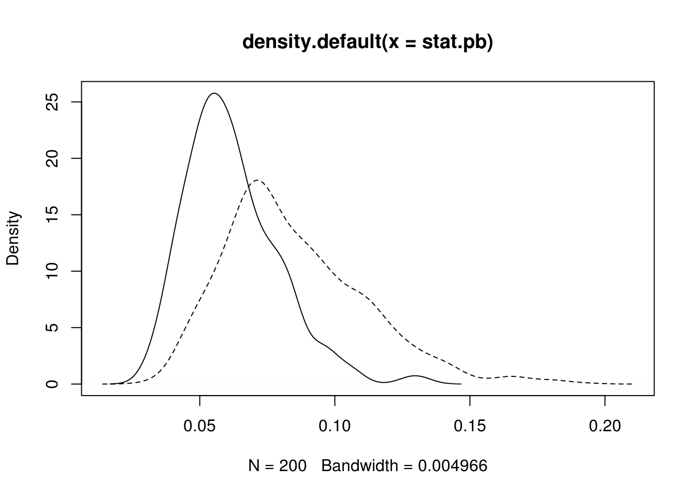
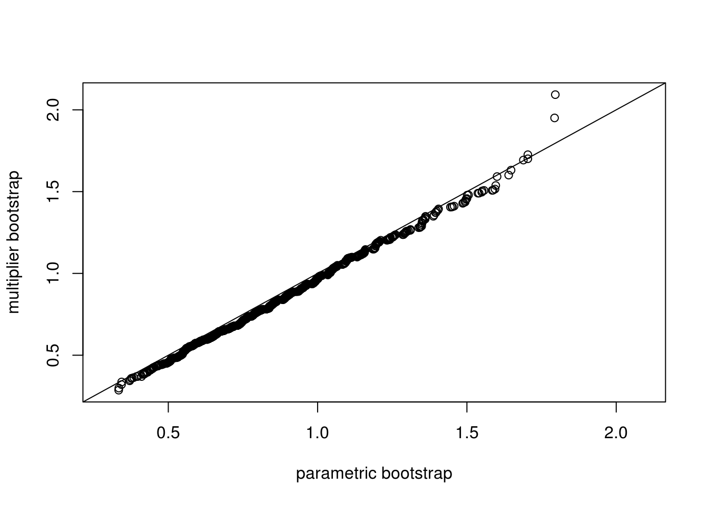

# Bootstrap {#boot}


## Principles of Bootstrap

Example from Efron's original 1979 paper.

```r
median.boot <- function(x, nboot) {
  tx <- median(x)
  sx <- sd(x)
  n <- length(x)
  do1rep <- function(x) {
    x.b <- sample(x, length(x), replace = TRUE)
    abs(median(x.b) - tx) / sx
  }
  r.sample <- replicate(nboot, do1rep(x))
  c(mean = mean(r.sample) * sqrt(n), sd = sd(r.sample))
}

x <- rnorm(13)

median.boot(x, 50)
```

```
##      mean        sd 
## 0.8155341 0.2507561
```

```r
sim <- replicate(200, median.boot(rnorm(13), 100))
summary(t(sim))
```

```
##       mean              sd        
##  Min.   :0.3411   Min.   :0.1109  
##  1st Qu.:0.7191   1st Qu.:0.2171  
##  Median :0.9299   Median :0.2615  
##  Mean   :0.9348   Mean   :0.2663  
##  3rd Qu.:1.1501   3rd Qu.:0.3134  
##  Max.   :1.9982   Max.   :0.5270
```


## Parametric Bootstrap

A parametric model is specified to the data, and the model parameters 
are estimated by likelihood methods, moment methods, or other methods.
Parametric bootstrap samples are generated from the fitted model, and 
for each sample the quantity to be bootstrapped is calculated.


Parametric bootstrap is often used to approximate the null 
distribution of a testing statistic which is otherwise unwieldy.
The uncertainty of parameter estimation can be accounted for.

### Goodness-of-Fit Test

Goodness of fit test with the KS statistic.
Consider two different null hypotheses:
\[
H_0: \mbox{ the data follows $N(2, 2^2)$ distribution,}
\]
and
\[
H_0: \mbox{ the data follows a normal distribution.}
\]
Note that the first hypothesis is a simple hypothesis while the second one is a composite hypothesis.

```r
do1rep <- function(n) {
  x <- rnorm(n, mean = 2, sd = 2)
  p1 <- ks.test(x, "pnorm", mean = 2, sd = 2)$p.value
  p2 <- ks.test(x, "pnorm", mean = mean(x), sd = sd(x))$p.value
  c(p1, p2)
}

set.seed(2020-12-01)
pvals <- replicate(1000, do1rep(100))

## par(mfrow=c(1, 2), mar=c(2.5, 2.5, 0.1, 0.1), mgp=c(1.5, 0.5, 0))
hist(pvals[1,])
```


```r
hist(pvals[2,])
```


```r
ks.test(pvals[1,], "punif")
```

```
## 
## 	One-sample Kolmogorov-Smirnov test
## 
## data:  pvals[1, ]
## D = 0.043786, p-value = 0.04322
## alternative hypothesis: two-sided
```

```r
ks.test(pvals[2,], "punif")
```

```
## 
## 	One-sample Kolmogorov-Smirnov test
## 
## data:  pvals[2, ]
## D = 0.47133, p-value < 2.2e-16
## alternative hypothesis: two-sided
```


Compare the histograms of the p-values obtained from applying `ks.test()` to $N(2, 2^2)$ and to $N(\hat\mu, \hat\sigma^2)$ with fitted mean $\hat\mu$ and variance $\hat\sigma^2$. The first one is what is expected from a $U(0, 1)$ distribution, but the second one is not, which confirms that direct application of `ks.test()` to fitted distribution is incorrect for the goodness-of-fit of the hypothesized distribution with unknown parameters that need to be estimated.


A parametric bootstrap procedure can be employed for such tests. The test statistic remain the same, but its null distribution is approximated from parametric bootstrap. 

```r
my.ks.normal <- function(x, B = 1000) {
  ## mle
  mu <- mean(x)
  sigma <- sd(x)
  ## KS stat
  stat <- ks.test(x, "pnorm", mu, sigma)$statistic
  ## parametric bootstrap to approximate the null distribution
  n <- length(x)
  stat.b <- double(B)
  for (i in 1:B) {
    x.b <- rnorm(n, mu, sigma)
    mu.b <- mean(x.b)
    sigma.b <- sd(x.b)
    stat.b[i] <- ks.test(x.b, "pnorm", mu.b, sigma.b)$statistic
  }
  p.value <- (sum(stat.b >= stat) + 0.5) / (B + 1)
  list(statistics = stat, p.value = p.value, 
       estimate = c(mean = mu, sd = sigma),
       stat.sim = stat.b)
}

pvals <- replicate(1000, my.ks.normal(rnorm(100, 2, 2), B = 200)$p.value)
## check the distribution of the pvals
hist(pvals)
```


```r
ks.test(pvals, "punif") 
```

```
## Warning in ks.test(pvals, "punif"): ties should not be present for the
## Kolmogorov-Smirnov test
```

```
## 
## 	One-sample Kolmogorov-Smirnov test
## 
## data:  pvals
## D = 0.042632, p-value = 0.05277
## alternative hypothesis: two-sided
```

```r
## this is not good because pvals has only (B + 1) possible values
## while ks.test cannot handle data with ties

## check the distribution of the testing statistics
stat.naive <- replicate(1000, ks.test(rnorm(100, 2, 2), "pnorm", 2, 2)$statistic)
## compare with the empirical distribution
stat.pb <- replicate(200, my.ks.normal(rnorm(100, 2, 2), B = 200)$statistic)
## plot them
dens.naive <- density(stat.naive)
dens.pb <- density(stat.pb)
## note that stat.pb tends to be smaller than stat.naiv
plot(dens.pb, xlim = range(dens.naive$x))
lines(density(stat.naive), lty=2)
```


Note that the KS statistic and the CvM statistic are functionals
of the empirical distribution and the fitted parametric distribution.
Faster alternatives are possible with the multiplier CLT
[@Koja:Yan:good:2012].


Chi-squared test is another goodness-of-fit test. Here is an example of
testing for generalized Pareto distribution. The correct degrees of freedom
depends on the estimation method [@chernoff1954use].

```r
n <- 500
theta <- c(scale = 1, shape = .2)
x <- texmex::rgpd(n, sigma = theta[1], xi = theta[2])
fit <- evir::gpd(x, threshold = 0)

my_chisq_test <- function(x, bins = seq(0.1, 0.9, by = 0.1), B = 1000,
                          method = c("ml", "minchisq")) {
    getstat <- function(x, thetahat, bins) {
        pp <- diff(c(0, bins, 1))
        qx <- quantile(x, bins)
        p <- texmex::pgpd(qx, sigma = thetahat[2], xi = thetahat[1])
        freq <- diff(n * c(0, p, 1))
        chisq.test(x = freq, p = pp)$statistic
    }
    min_chisq <- function(x, init, bins) {
        fit <- optim(init,
                     function(th) getstat(x, th, bins))
        fit
    }
    method <- match.arg(method)
    ## observed stat
    n <- length(x)
    thetahat <- evir::gpd(x, threshold = 0)$par.ests
    if (method == "minchisq") thetahat <- min_chisq(x, thetahat, bins)$par
    stat <- getstat(x, thetahat, bins)
    if (B <= 0) return(stat)

    ## bootstrap stat
    stat.b <- double(B)
      for (i in 1:B) {
        x.b <- texmex::rgpd(n, sigma = thetahat[2], xi = thetahat[1])
        thetahat.b <- evir::gpd(x.b, threshold = 0)$par.ests
        if (method == "minchisq") thetahat.b <- min_chisq(x.b, thetahat.b, bins)$par
        stat.b[i] <- getstat(x.b, thetahat.b, bins)
      }
      p.value <- (sum(stat.b >= stat) + 0.5) / (B + 1)
      list(statistics = stat, p.value = p.value, 
           estimate = thetahat,
           stat.sim = stat.b)
}

my_chisq_test(x)$p.value
```

```
## [1] 0.6938062
```

```r
y <- rlnorm(500)
my_chisq_test(y)$p.value
```

```
## [1] 0.007492507
```

```r
## replicated p-value should follow U(0, 1) under H0
## pvals <- replicate(500, my_chisq_test(texmex::rgpd(n, sigma = theta[1], xi = theta[2]))$p.value)

## compare the distribution of the testing statistic with chi-squared
stat.ch <- replicate(1000,
                     my_chisq_test(texmex::rgpd(n, sigma=theta[2], xi=theta[1]),
                                   B = 0, method = "minchisq"))
stat.ml <- replicate(1000,
                     my_chisq_test(texmex::rgpd(n, sigma=theta[2], xi=theta[1]),
                                   B = 0, method = "ml"))

## hist(stat.ml, prob=TRUE, breaks = 30)
plot(density(stat.ch))
kdens <- density(stat.ml)
lines(kdens$x, kdens$y, col = "blue")
curve(dchisq(x, df = 7), add = TRUE, col = "red")
curve(dchisq(x, df = 9), add = TRUE, col = "purple")
```


## Block bootstrap


```r
n <- 200
x <- stats::arima.sim(list(ar = 0.5), n) + 2

nmblk <- function(n, l) {
    b <- n / l # assuming that is an integer
    idx <- sample(seq(1, n - l + 1, by = l), b, replace = TRUE)
    c(outer(0:(l - 1), idx, "+"))
}

mvblk <- function(n, l) {
    b <- n / l
    idx <- sample(1:(n - l + 1), b, replace = TRUE)
    c(outer(0:(l - 1), idx, "+"))
}
      

blkboot <- function(tseries, statistic, R, l) {
    n <- length(tseries)
    ## observed statistic
    stat <- statistic(tseries)
    ## nonmoving block bootstrap
    nm.stat <- replicate(R, statistic(tseries[nmblk(n, l)]))
    ## moving block bootstrap
    mv.stat <- replicate(R, statistic(tseries[mvblk(n, l)]))
    list(stat = stat, nm.stat = nm.stat, mv.stat = mv.stat)
}

## an experiment
ar1 <- function(x) cor(x[-1], x[-length(x)])

do1rep <- function(n, theta, l) {
    x <- arima.sim(list(ar = theta), n)
    bt <- blkboot(x, ar1, 1000, l)
    c(bt$stat, sd(bt$nm.stat), sd(bt$mv.stat))
}

sim <- replicate(200, do1rep(100, 0.5, 10))
```

## Semiparametric bootstrap
@Heff:Tawn:cond:2004 applied a semiparametric bootstrap method [@Davi:Hink:boot:1997] in multivariate extreme value modeling. The challenge here is that, although univariate margins are fitted fine with generalized extreme value (GEV) distributions, an extreme-value dependence structure may be too strong an assumption to be practical. How does one obtain bootstrap samples of a semiparametric model where the marginal models are specified but the dependence structure is not?


To ensure that the bootstrap samples replicate both the marginal and the dependence features ofthe data, @Heff:Tawn:cond:2004 proposed a two-step bootstrap algorithm. A nonparametric bootstrap is employed first, ensuring the preservation of the dependence structure; then a parametric step is carried out to assess the uncertainty in the estimation of the parametric marginal models. The precise procedure is as follows. The original data are first transformed to have Gumbel margins using the fitted marginal models from the original data. A nonparametric bootstrap sample is then obtained by sampling with replacement from the transformed data. We then change the marginal values of this bootstrap sample, ensuring that the marginal distributions are all Gumbel and preserving the associations between the ranked points in each component. Specifically, for each $i$, $i = 1, \ldots, d$, where $d$ is the multivariate dimension, replace the ordered sample of component $Y_i$ with an ordered sample of the same size from the standard Gumbel distribution. The resulting sample is then transformed back to the original margins by using the marginal model that was estimated from the original data. The bootstrap samples obtained this way have desired univariate marginal distributions and dependence structure entirely consistent with the data as determined by the associations between the ranks of the components of the variables.


```r
bootHT <- function(rkmat) {
  nr <- nrow(rkmat)
  nc <- ncol(rkmat)
  ## resampling rows
  idx <- sample(1:nr, nr, replace=TRUE)
  rkmat.bt <- rkmat[idx, ]
  ## reordering iid uniform variables for each column
  vv <- matrix(runif(nr * nc), nr, nc)
  sapply(1:nc, function(i) sort(vv[,i])[rkmat.bt[,i]])
}

ns <- 6
nt <- 10
umat <- copula::rCopula(nt, copula::normalCopula(0.6, dim = ns, dispstr = "ar1"))
rkmat <- apply(umat, 2, rank, ties.method = "random")
set.seed(123)
umat.bt <- bootHT(rkmat)

ht <- replicate(1000, bootHT(rkmat))
str(ht)
```

```
##  num [1:10, 1:6, 1:1000] 0.344 0.333 0.467 0.188 0.467 ...
```

```r
hist(ht[3, 3, ])
```


```r
hist(ht[4, 5, ])
```


```r
plot(ht[2, 3, ], ht[2, 4, ])
```


What if the data is not balanced and the blocks are of different sizes?


## Multiplier bootstrap
### Multiplier central limit theorem
The theoretical background and presentation of the multiplier CLT
can be found in Section~2.9 of @van:Well:weak:1996.
Let $X_1, \ldots, X_n$ be a random sample from a distribution $P$.
Let $\delta_x(t) = I(x <= t)$.
With the notation $Z_i(t) = \delta_{X_i}(t) - P(t)$, the empirical
CLT can be written as 
\[
\frac{1}{\sqrt{n}} \sum_{i = 1}^n Z_i \to \mathbb{G}
\]
where $\mathbb{G}$ is a Brownian bridge.


Let $\xi_1, \ldots, \xi_n$ be a set of iid random variables with
mean zero and variance 1, and independent of $X_1, \ldots, X_n$.
The multiplier CLT asserts that
\[
\frac{1}{\sqrt{n}} \sum_{i=1}^n \xi_i Z_i \to \mathbb{G},
\]
under some conditions about the (Donsker) class of the distribution $P$.


A more refined and deeper result is the conditional multiplier CLT
which states that 
\[
\frac{1}{\sqrt{n}} \sum_{i=1}^n \xi_i Z_i \to \mathbb{G},
\]
given almost every sequence of $Z_i, Z_2, \ldots$, under
only slightly stronger conditions.


For illustration, consider a scalar. We first look at the unconditional version; that is, the observed data is not fixed.

```r
n <- 100
nrep <- 1000

## CLT and Multiplier CLT
do1rep <- function(n) {
  x <- rexp(n)
  z1 <- sum(x - 1) / sqrt(n)
  z2 <- sum((x - 1) * rnorm(n)) / sqrt(n)
  z3 <- sum((x - 1) * ifelse(runif(n) < 0.5, 1, -1)) / sqrt(n)
  c(z1, z2, z3)
}

clt <- replicate(nrep, do1rep(n))

## check normality of each component
qqnorm(clt[1,], xlim = c(-3, 3), ylim = c(-3, 3), main = "")
qqline(clt[1,])
```


```r
qqnorm(clt[2,], xlim = c(-3, 3), ylim = c(-3, 3), main = "")
qqline(clt[2,])
```


```r
qqnorm(clt[3,], xlim = c(-3, 3), ylim = c(-3, 3), main = "")
qqline(clt[3,])
```


Now we look at the conditional version where the observed data are conditioned on.


```r
## Conditional multiplier CLT
x <- rexp(n) ## given one sample
cclt1rep <- function(x) {
  n <- length(x)
  z2 <- sum((x - 1) * rnorm(n)) / sqrt(n)
  z3 <- sum((x - 1) * ifelse(runif(n) < 0.5, 1, -1)) / sqrt(n)
  c(z2, z3)
}

cclt <- replicate(nrep, cclt1rep(x))
## par(mfrow=c(1, 2), mar=c(2.5, 2.5, 0.1, 0.1), mgp=c(1.5, 0.5, 0))
qqnorm(cclt[1,], xlim = c(-3, 3), ylim = c(-3, 3), main = "")
qqline(cclt[1,])
```


```r
qqnorm(cclt[2,], xlim = c(-3, 3), ylim = c(-3, 3), main = "")
qqline(cclt[2,])
```


The process version retains the dependence structure which saves much computing time in many applications such as goodness-of-fit tests.

```r
uu <- (1:(2 * n) + 0.5) / (2 * n + 1)
tt <- qexp(uu)

## sampling from the distribution of the KS statistic
ks1rep <- function(n, tt) {
  x <- rexp(n)
  ## rate <- 1 / mean(x)
  ## using the true rate parameter in pexp
  ## if estimate is used, it will be a different distribution
  indXt <- sapply(tt, function(t) ifelse(x <= t, 1, 0))
  Ft <- matrix(pexp(tt), n, length(tt), byrow = TRUE)
  z1 <- colSums(indXt - Ft) / sqrt(n)
  ## z1 <- sqrt(n) * (ecdf(x)(tt) - pexp(tt)) ## equivalent but less visual
  z2 <- colSums( rnorm(n) * (indXt - Ft) ) / sqrt(n)
  c(max(abs(z1)), max(abs(z2)))
}

system.time(ksSamp <- replicate(nrep, ks1rep(n, tt)))
```

```
##    user  system elapsed 
##   2.303   0.000   2.303
```

```r
ks1cclt <- function(x, tt) {
  n <- length(x)
  indXt <- sapply(tt, function(t) ifelse(x <= t, 1, 0))
  Ft <- matrix(pexp(tt), n, length(tt), byrow = TRUE)
  z <- colSums( rnorm(n) * (indXt - Ft) ) / sqrt(n)
  max(abs(z))
}

system.time(ksMult <- replicate(nrep, ks1cclt(x, tt)))
```

```
##    user  system elapsed 
##   2.101   0.000   2.101
```

```r
ran <- range(c(ksSamp, ksMult))
qqplot(ksSamp[1,], ksSamp[2,], main = "", xlim = ran, ylim = ran,
       xlab = "parametric bootstrap", ylab = "multiplier bootstrap")
abline(0, 1)
```



```r
qqplot(ksSamp[1,], ksMult, main = "", xlim = ran, ylim = ran,
       xlab = "parametric bootstrap", ylab = "conditional multipler bootstrap")
abline(0, 1)
```


Application of the multiplier CLT needs the asymptotic representation of the random quantities or process of interest.

Question: for goodness-of-fit tests with unknown parameters, how would the procedure of the conditional multiplier approach change? This is the subject of @Koja:Yan:good:2012.


## Exercises

1. Suppose that $X$ and $Y$ are independent 
   $\Gamma(\alpha_1, \beta_1)$ and $\Gamma(\alpha_2, \beta_2)$
   variables, where
   $\Gamma(a, b)$ have mean $a b$. We are interested in point and
   interval estimation of $\theta = \E(X) / \E(Y)$ based on two
   independent samples of size $n_1$ and $n_2$, respectively. Consider
   for example $\alpha_1 = \beta_1 = 2$, $\alpha_2 = 4$, $\beta = 2$,
   $n_1 = 10$ and $n_2 = 15$. Set the random seed to be 123 for
   reproducibility. Let $\bar X$ and $\bar Y$ be the sample
   means. Consider statistic $T = \bar X / \bar Y$.

    a. Given the sample, draw bootstrap samples of $T$ using the
    nonparametric method and the parametric method with sample size
	$B  = 1000$.
    a. Correct the bias of $T$ in estimating $\theta$. 
    a. Construct a 95\% bootstrap percentile confidence interval for $\theta$.
    a. Repeat the experiments 1000 times. Compare the average bias
    with the exact bias; compare the empirical coverage of the 95\%
    bootstrap confidence interval with the nominal level.

1. One goodness-of-fit diagnosis is the QQ plot. Consider a random
   sample of size $n$ from $N(\mu, \sigma^2)$. A QQ plot displays the
   empirical quantiles against the theoretical quannntiles. For
   uncertainty assessment, a pointwise confidence interval constructed
   from simulation is often overlaid . In practice, the parameters of
   the distribution to be checked are unknown and the estimation
   uncertainty needs to be take into account. Let $n = 10$, $\mu = 0$,
   and $\sigma^2 = 1$.
   
    a. Construct a QQ plot with pointwise confidence intervals with
    known $\mu$ and $\sigma^2$.
	a. Construct a QQ plot with pointwise confidence intervals with
    estimated $\mu$ and $\sigma^2$. The uncertainty in estimated
    parameters can be realized by bootstrapping.
	a. Repeat with sample size $n \in \{20, 30\}$.
