# (APPENDIX) Appendix {-}

# Git Setup

To participate in the git lesson,
you need to:

1. Download and install
    - [R](https://cloud.r-project.org/)
    - [RStudio Desktop](https://www.rstudio.com/products/rstudio/download/#download)
    - git:
	    - [Windows](https://git-for-windows.github.io/) - to install see section \@ref(git-windows) below.
		- [OS X &ge; 10.9](http://sourceforge.net/projects/git-osx-installer/files/)
		- [OS X &le; 10.8 snow-leopard](http://sourceforge.net/projects/git-osx-installer/files/)
1. The location of the **Git executable** in RStudio is set in
   **Tools > Global Options... > Git/SVN**
   as shown in the screenshot below.
   The default location of **/usr/bin/git** won't work for most people, so
   set the location of **Git executable** as follows:
    - Windows = **C:/Program Files/Git/bin/git.exe**
	- OS X = **/usr/local/bin/git**

   If you need to change this location setting,
   you will need to restart RStudio for the new Git location to apply.
1. Setup your SSH RSA key if necessary in RStudio -
   if your **SSH RSA key** is **(none)**
   instead of **~/.ssh/id_rsa** or similar, then
   click on the button to **Create RSA key...**
1. Have a [github.com](https://github.com) account, and
1. Copy your SSH RSA key to github.com -
   in the RStudio window below click on **View public key**
   and copy the public key to your account as explained in step 2 onwards:
   https://help.github.com/en/articles/adding-a-new-ssh-key-to-your-github-account
5. Install the `tidyverse` and `modelr` packages in RStudio.

```{r RStudio git settings, cache = TRUE, echo = FALSE}
knitr::include_graphics("images/rstudio-git-settings.png")
```

## Git for Windows installer {#git-windows}

These instructions
^[These Git Windows installer steps
are from the
[Software Carpentry setup page](https://carpentries.github.io/workshop-template/#git).]
are for Windows only:

1. Click on **Next** four times (two times if you've previously installed Git). You don't need to change anything in the Information, location, components, and start menu screens.
1. Select **Use the nano editor by default** and click on **Next**.
1. Keep **Git from the command line and also from 3rd-party software** selected and click on **Next**.
1. Click on **Next**.
1. Select **Use the native Windows Secure Channel library**, and click **Next**.
1. Keep **Checkout Windows-style, commit Unix-style line endings** selected and click on **Next**.
1. Select **Use Windows' default console window** and click on **Next**.
1. Leave all three items selected, and click on **Next**.
1. Do not select the experimental option. Click **Install**.
1. Click on **Finish**.

# Git Lesson

Adapted from Software Carpentry's
[Git lesson](https://swcarpentry.github.io/git-novice/),
sections 1 through 7.
The primary difference is we're learning RStudio's git interface
instead of using direct git commands.

- Teaching 25 min
- Exercises 5 min

**Learning Goals**

- What is version control and why should I use it?
- Where does Git store information?
- How do I record changes in Git?
- How do I check the status of my version control repository?
- How do I record notes about what changes I made and why?
- How can I identify old versions of files?
- How do I review my changes?
- How can I recover old versions of files?
- How can I tell Git to ignore files I don’t want to track?
- How do I share my changes with others on the web?


**Learning Objectives**

- Understand the benefits of an automated version control system.
- Understand the basics of how Git works.
- Create a local Git repository.
- Go through the modify-add-commit cycle for one or more files.
- Explain where information is stored at each stage of that cycle.
- Distinguish between descriptive and non-descriptive commit messages.
- Identify and use Git commit numbers.
- Compare various versions of tracked files.
- Restore old versions of files.
- Configure Git to ignore specific files.
- Explain why ignoring files can be useful.
- Explain what remote repositories are and why they are useful.
- Push to or pull from a remote repository.

**Key Points**

- Version control is like an unlimited 'undo'.
- Version control also allows many people to work in parallel.
- Initialize a Git repository.
- Git stores all of its repository data in the `.git/` directory.
- See the status of a repository.
- Files can be stored in a project’s working directory (which users see), the staging area (where the next commit is being built up) and the local repository (where commits are permanently recorded).
- Checking the box puts files in the staging area.
- Commit saves the staged content as a new commit in the local repository.
- Write a commit message that accurately describes your changes.
- Diff displays differences between commits.
- Checkout recovers old versions of files.
- The `.gitignore` file tells Git what files to ignore.
- A local Git repository can be connected to one or more remote repositories.
- Use the HTTPS protocol to connect to remote repositories only if you do not have commit access, otherwise set up SSH with RSA keys.
- Push copies changes from a local repository to a remote repository.
- Pull copies changes from a remote repository to a local repository.

## Automated Version Control

Even if you aren’t collaborating with other people,
automated version control is much better than this situation:

```{r PhD comics FINAL.doc, echo = FALSE}
knitr::include_graphics("images/phd101212s.png")
```

A key difference of the Git version control system from
the "Track Changes" in Microsoft Word is
the database of changes is stored separately from the document.
We will see where these changes are stored at the end of our next section.

```{r track changes fork and merge, cache = TRUE, echo = FALSE}
knitr::include_graphics("images/play-changes.svg")
knitr::include_graphics("images/versions.svg")
knitr::include_graphics("images/merge.svg")
```

Several incentives for using version control according to a commenter on
StackOverflow
^[https://stackoverflow.com/a/1408464] are:

> Have you ever:
>
> - Made a change to code, realised it was a mistake and wanted to revert back?
> - Lost code or had a backup that was too old?
> - ...
> - Wanted to see the difference between two (or more) versions of your code?
> - Wanted to prove that a particular change broke or fixed a piece of code?
> - Wanted to review the history of some code?
> - Wanted to submit a change to someone else's code?
> - Wanted to share your code, or let other people work on your code?
> - Wanted to see how much work is being done, and where, when and by whom?
> - Wanted to experiment with a new feature without interfering with working code?
>
> In these cases, and no doubt others, a version control system should make your life easier.

Most often though,
we use version control as our magic undo button
for restoring plain text files like R source code:

```{r undo button, cache = TRUE, echo = FALSE}

```

## Setup

Please setup R, RStudio, git, your SSH keys, create your GitHub account,
and install the R packages as explained in appendix \@ref(git-setup).

## Creating a Repository

RStudio automates repository creation for us,
by tying it into the RStudio project.

To create a local Git repository,
make sure you check the box **Create a git repository**
when you run **File > New Project... > New Directory > New Project**

```{r RStudio git new project, cache = TRUE, echo = FALSE}
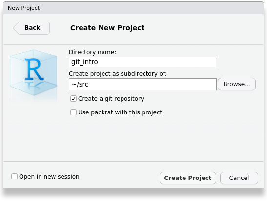
```

That check box enables an additional Git tab in RStudio:

```{r RStudio git tab new, cache = TRUE, echo = FALSE}
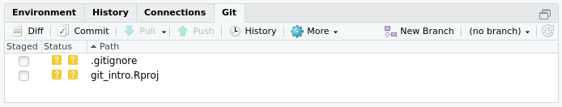
```

The reason we see the Git tab is because the `git` program
creates a directory `.git/` inside our project directory.
Never delete this directory,
because this is your Git database that stores all of your changes and history.
You cannot see this special `.git/` directory unless you
**Show hidden files** in RStudio.
But let's disable the **Show hidden files** now that we know
where our `.git/` directory lives.

```{r RStudio git files tab hidden, cache = TRUE, echo = FALSE}
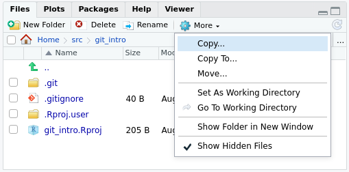
```

## Setting up Git Authorship

Tell Git who you are by clicking on the **Git** tab in RStudio
and opening **More > Shell...**

```{r RStudio git tab more, cache = TRUE, echo = FALSE}
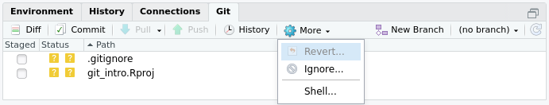
```

Check what your git configuration looks like by running the command:

```bash
git config --global --list

#> Output of the above command might look similar to:
#>
#> user.email=firstname.lastname@uconn.edu
#> user.name=Firstname Lastname
#> core.autocrlf=input
```

If you have never used git on your particular computer before,
you will have to set your global `user.name` and `user.email`.
The commands to do that are:

```bash
git config --global user.name "Firstname Lastname"
git config --global user.email firstname.lastname@uconn.edu
```

Of course, replace `"Firstname Lastname"` and `firstname.lastname@uconn.edu`
with your actual name and e-mail.

You can re-run the `--list` command above to check your new settings.

## Tracking Changes

We see some yellow question marks in our Git tab:

```{r RStudio git tab nothing staged, echo = FALSE}

```

The yellow question marks tell us that git is not tracking those files;
if the files were to change, git would not be able to help us undo the change.
To start tracking the files, click on the **Staged** checkboxes 
next to the files:

```{r RStudio git tab first files staged, echo = FALSE}
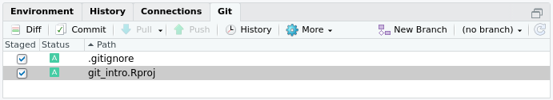
```

Click on the **Commit** button
and enter a **Commit message** such as "Create RStudio project":

```{r RStudio git tab first commit, echo = FALSE}
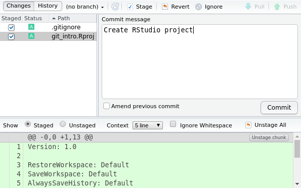
```

Then click the Commit button to save the files 
with the message to the git database:

```{r RStudio git tab first commit complete, echo = FALSE}
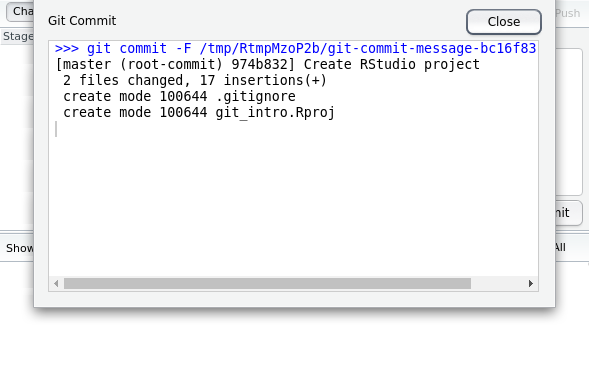
```

You created your first git commit!

Each commit has a unique version hash associated with it.
Older version control systems used to use versions like 1, 2, 3...
however newer systems like Git no longer uses sequential numbers
because that causes problems with collaboration.
Instead Git creates a hash; in the screenshot above,
we can see the hash version identifier is `974b832`.

Git creates the creates the unique by using information about the files,
your author name and e-mail, the time at which the commit happened, etc.

Why did we need to check the boxes next to the files in the **Staged** column?

The Git stage
is a place to include multiple files with a related change.

```{r Staging files, echo = FALSE}
knitr::include_graphics("images/git-staging-area.svg")
knitr::include_graphics("images/git-committing.svg")
```

You can think of the Git stage like the small "staging" area under your feet
where people gather to take a photograph.
Most often though, only one file is changed at a time,
which would make our "photograph" of a single file more like selfie.

```{r Staging a single file is like taking a selfie, echo = FALSE}

```

If we close those pop up windows, we now see that our stage is empty:

```{r Stage is empty after a commit, echo = FALSE}
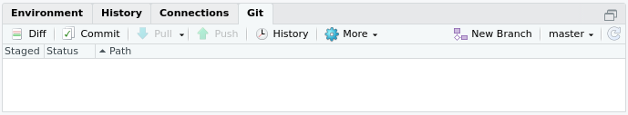
```

After taking the photo, our friends have moved off the stage
to free the area for taking future photos.

Our goal when using Git is always to have a "clean" stage,
because that means all of our work is saved.

Now create another commit with our first file `model.R`.
Click on **File > New File > R Script** and run the script:


```{r Hide package startup messages, echo = FALSE}
suppressPackageStartupMessages({
	library(tidyverse)
	library(modelr)
})
```

```{r Create the model.R script, results = FALSE}
library(tidyverse)
library(modelr)

sim1

ggplot(sim1, aes(x, y)) +
    geom_point()
```

Commit these changes with the message "Inspect raw data".

Let's add more lines to our script to fit a linear model:

```{r Fit a linear model, results = FALSE}
library(tidyverse)
library(modelr)

sim1

model_lm <- lm(y ~ x, data = sim1)
coef <- coef(model_lm)
coef

ggplot(sim1, aes(x, y)) +
    geom_point() +
    geom_abline(intercept = coef[1],
                slope = coef[2])
```

Note how now we see a blue "M" icon in the **Status** column
indicating that our tracked file has been "Modified":

```{r Stage has a modified file, echo = FALSE}
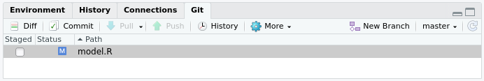
```

Don't commit our new changes just yet.
Instead click on the **Diff** button:

```{r Diff of unstaged file, echo = FALSE}
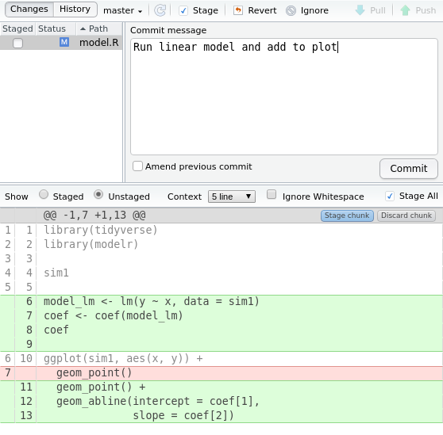
```

Click on the **Commit** button as usual.  This creates an error:

```{r Error committing unstaged file, echo = FALSE}
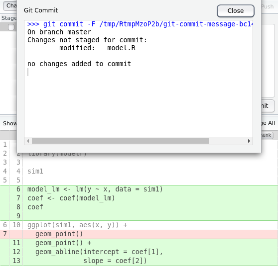
```

Fix this by clicking on the **Staged** checkbox and then click **Commit**.

## Undo Changes

Sometimes a script stops working because of accidental changes.
Perhaps a chunk of code was accidentally deleted and
replaced with some junk text.  How would we repair this
with our Git history?

```{r Accidental modification of model.R, eval = FALSE}
library(tidyverse)
library(modelr)

fja3q2rl;js
```

We have saved the problematic file and Git sees it as modified:

```{r Stage has an accidentally modified file, echo = FALSE}

```

One possible solution is to look back at the previous history and copy the code,
but the really quick and simple fix is using Git's **Revert** button instead.
Clicking on **Diff** and then **Revert**
restores the tracked file to the last commit version.

Now our `model.R` file is back to the last commit version
and our stage is clean because all files are the same as the
last commit version:

```{r Reverted model.R, eval = FALSE}
library(tidyverse)
library(modelr)

sim1

model_lm <- lm(y ~ x, data = sim1)
coef <- coef(model_lm)
coef

ggplot(sim1, aes(x, y)) +
    geom_point() +
    geom_abline(intercept = coef[1],
                slope = coef[2])
```

```{r Stage is empty after revert, echo = FALSE}

```

Instead of going back to the last commit version
we may want to go back to a much older version,
say from several months ago.
RStudio does not have a quick way of going back further than the last version,
so we have to access the full power of the Git from the command line.
In RStudio, click on **Tools > Shell...**
to open a shell at your Git directory.
Then to list all your recent commits, in the shell type `git log` and hit enter:

```bash
git log

#> commit 17a6f9a4fbcfdbb8091965ef75742ec3fc1f67cb (HEAD -> master)
#> Author: Pariksheet Nanda <pariksheet.nanda@uconn.edu>
#> Date:   Thu Aug 29 10:25:20 2019 -0400
#>
#>     Run linear model and add to plot
#>
#> commit c9da9361868d5f568471c14dd8b8b29e72ea5236
#> Author: Pariksheet Nanda <pariksheet.nanda@uconn.edu>
#> Date:   Thu Aug 29 10:17:26 2019 -0400
#>
#>     Inspect raw data
#>
#> commit 974b8325da19cf35bb5e73639943b9bfee5c4091
#> Author: Pariksheet Nanda <pariksheet.nanda@uconn.edu>
#> Date:   Thu Aug 29 09:45:36 2019 -0400
#>
#>     Create RStudio project
```

Note how instead of the abbreviated 7 letter hash we now see the full 40 letter
hash; for example instead of `974b832` we see our first commit version hash
is actually `974b8325da19cf35bb5e73639943b9bfee5c4091`.

To use one of these old commits, we can use the full hash.
Let's say we want our code at the "Inspect raw data" state before we added
the linear model.  In the shell we would run the Git command:

```bash
git checkout c9da9361868d5f568471c14dd8b8b29e72ea5236 model.R
```

Note that we must specify the `model.R` file at the end we want to restore.

Going from the shell back to RStudio, we can save the older version of the file
as a new commit with a message like "Remove linear model fit":

```{r Commit old version, echo = FALSE}
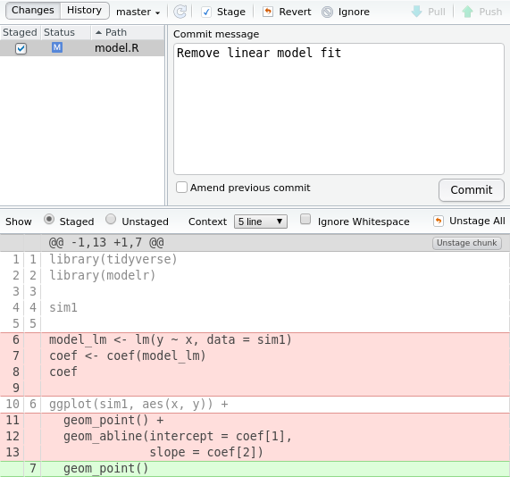
```

In the shell, if we accidentally neglected to specify the file to restore,
we will run into a detached HEAD state
where none of our new history will be saved:

```bash
git checkout c9da9361868d5f568471c14dd8b8b29e72ea5236

#> Note: checking out 'c9da9361868d5f568471c14dd8b8b29e72ea5236'.
#>
#> You are in 'detached HEAD' state. You can look around, make experimental
#> changes and commit them, and you can discard any commits you make in this
#> state without impacting any branches by performing another checkout.
#>
#> If you want to create a new branch to retain commits you create, you may
#> do so (now or later) by using -b with the checkout command again. Example:
#>
#>   git checkout -b <new-branch-name>
#>
#> HEAD is now at c9da936 Inspect raw data
```

Running into this detached HEAD state from forgetting to write the file name
is common typo, and to fix the detached HEAD state
we need to tell Git to get back to our default `master` branch:

```bash
git checkout master

#> Previous HEAD position was c9da936 Inspect raw data
#> Switched to branch 'master'
```

Phew!  Now Git behavior is back to normal.

## Explore History

Now that we have a few commits in our history,
click on the **History** button with a clock icon:

```{r Git tab with history icon, echo = FALSE}

```

This opens up a window with our 4 commits.
You can click on the commit and the modified file to see which lines
were added and removed:

```{r Git history window, echo = FALSE}
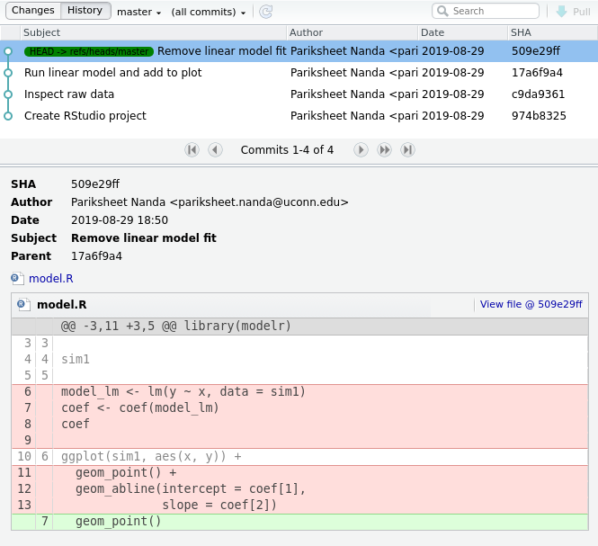
```

## Next Steps

- Read sections 8 onwards of the Software Carpentry
  [Git lesson](https://swcarpentry.github.io/git-novice/).
- If you enjoy using Git or R and want to teach others to use these tools
  alongside experienced volunteer instructors,
  consider getting your free
  [Carpentries instructor certification](https://carpentries.org/volunteer/).
  There are
  [several certified Carpentries instructors at UConn](https://carpentries.org/instructors/)
  and we would be happy to talk to you about our workshops.
