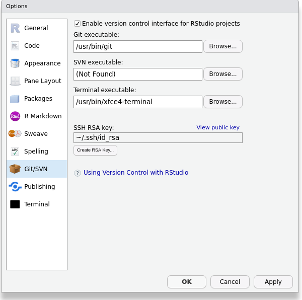

# (APPENDIX) Appendix {-}

# Git Setup

To participate in the git lesson,
you need to:

1. Download and install
    - [R](https://cloud.r-project.org/)
    - [RStudio Desktop](https://www.rstudio.com/products/rstudio/download/#download)
    - git:
	    - [Windows](https://git-for-windows.github.io/) - to install see section \@ref(git-windows) below.
		- [OS X &ge; 10.9](http://sourceforge.net/projects/git-osx-installer/files/)
		- [OS X &le; 10.8 snow-leopard](http://sourceforge.net/projects/git-osx-installer/files/)
2. Setup your SSH RSA key if necessary in RStudio -
   only if your **SSH RSA key** is **(none)**, then
   click on the button to **Create RSA key...**
3. Have a [github.com](https://github.com) account, and
4. Copy your SSH RSA key to github.com -
   in the RStudio window below click on **View public key**
   and copy the public key to your account as explained in step 2 onwards:
   https://help.github.com/en/articles/adding-a-new-ssh-key-to-your-github-account

To quickly check that you are fully setup, in RStudio, open
**Tools > Global Options... > Git/SVN** and check
that RStudio sees values for **Git executable** and
**SSH RSA key**.

```{r RStudio git settings, cache = TRUE, echo = FALSE}

```

## Git for Windows installer {#git-windows}

These instructions
^[These Git Windows installer steps
are from the
[Software Carpentry setup page](https://carpentries.github.io/workshop-template/#git).]
are for Windows only:

1. Click on **Next** four times (two times if you've previously installed Git). You don't need to change anything in the Information, location, components, and start menu screens.
1. Select **Use the nano editor by default** and click on **Next**.
1. Keep **Git from the command line and also from 3rd-party software** selected and click on **Next**.
1. Click on **Next**.
1. Select **Use the native Windows Secure Channel library**, and click **Next**.
1. Keep **Checkout Windows-style, commit Unix-style line endings** selected and click on **Next**.
1. Select **Use Windows' default console window** and click on **Next**.
1. Leave all three items selected, and click on **Next**.
1. Do not select the experimental option. Click **Install**.
1. Click on **Finish**.

# Git Lesson

Adapted from Software Carpentry's
[Git lesson](https://swcarpentry.github.io/git-novice/),
sections 1 through 7.
The primary difference is we're learning RStudio's git interface
instead of using direct git commands.

- Teaching 25 min
- Exercises 5 min

**Learning Goals**

- What is version control and why should I use it?
- Where does Git store information?
- How do I record changes in Git?
- How do I check the status of my version control repository?
- How do I record notes about what changes I made and why?
- How can I identify old versions of files?
- How do I review my changes?
- How can I recover old versions of files?
- How can I tell Git to ignore files I don’t want to track?
- How do I share my changes with others on the web?


**Learning Objectives**

- Understand the benefits of an automated version control system.
- Understand the basics of how Git works.
- Create a local Git repository.
- Go through the modify-add-commit cycle for one or more files.
- Explain where information is stored at each stage of that cycle.
- Distinguish between descriptive and non-descriptive commit messages.
- Identify and use Git commit numbers.
- Compare various versions of tracked files.
- Restore old versions of files.
- Configure Git to ignore specific files.
- Explain why ignoring files can be useful.
- Explain what remote repositories are and why they are useful.
- Push to or pull from a remote repository.

**Key Points**

- Version control is like an unlimited 'undo'.
- Version control also allows many people to work in parallel.
- Initialize a Git repository.
- Git stores all of its repository data in the `.git/` directory.
- See the status of a repository.
- Files can be stored in a project’s working directory (which users see), the staging area (where the next commit is being built up) and the local repository (where commits are permanently recorded).
- Checking the box puts files in the staging area.
- Commit saves the staged content as a new commit in the local repository.
- Write a commit message that accurately describes your changes.
- Diff displays differences between commits.
- Checkout recovers old versions of files.
- The `.gitignore` file tells Git what files to ignore.
- A local Git repository can be connected to one or more remote repositories.
- Use the HTTPS protocol to connect to remote repositories only if you do not have commit access, otherwise set up SSH with RSA keys.
- Push copies changes from a local repository to a remote repository.
- Pull copies changes from a remote repository to a local repository.

## Automated Version Control

Even if you aren’t collaborating with other people,
automated version control is much better than this situation:

```{r PhD comics FINAL.doc, echo = FALSE}
knitr::include_graphics("images/phd101212s.png")
```

A key difference of the Git version control system from
the "Track Changes" in Microsoft Word is
the database of changes is stored separately from the document.
We will see where these changes are stored at the end of our next section.

```{r track changes fork and merge, cache = TRUE, echo = FALSE}
knitr::include_graphics("images/play-changes.svg")
knitr::include_graphics("images/versions.svg")
knitr::include_graphics("images/merge.svg")
```

Several incentives for using version control according to a commenter on
StackOverflow
^[https://stackoverflow.com/a/1408464] are:

> Have you ever:
>
> - Made a change to code, realised it was a mistake and wanted to revert back?
> - Lost code or had a backup that was too old?
> - ...
> - Wanted to see the difference between two (or more) versions of your code?
> - Wanted to prove that a particular change broke or fixed a piece of code?
> - Wanted to review the history of some code?
> - Wanted to submit a change to someone else's code?
> - Wanted to share your code, or let other people work on your code?
> - Wanted to see how much work is being done, and where, when and by whom?
> - Wanted to experiment with a new feature without interfering with working code?
>
> In these cases, and no doubt others, a version control system should make your life easier.

Most often though,
we use version control as our magic undo button
for restoring plain text files like R source code:

```{r undo button, cache = TRUE, echo = FALSE}
knitr::include_graphics("images/undo-button.jpg")
```

## Setup

Please setup R, RStudio, git, your SSH keys, and create your GitHub account
as explained in appendix \@ref(git-setup).

## Creating a Repository

RStudio automates repository creation for us,
by tying it into the RStudio project.

To create a local Git repository,
make sure you check the box **Create a git repository**
when you run **File > New Project... > New Directory > New Project**

```{r RStudio git new project, cache = TRUE, echo = FALSE}
knitr::include_graphics("images/rstudio-git-new-project.png")
```

That check box enables an additional Git tab in RStudio:

```{r RStudio git tab new, cache = TRUE, echo = FALSE}
knitr::include_graphics("images/rstudio-git-tab-new.png")
```

The reason we see the Git tab is because the `git` program
creates a directory `.git/` inside our project directory.
Never delete this directory,
because this is your Git database that stores all of your changes and history.
You cannot see this special `.git/` directory unless you
**Show hidden files** in RStudio.
But let's disable the **Show hidden files** now that we know
where our `.git/` directory lives.

```{r RStudio git files tab hidden, cache = TRUE, echo = FALSE}
knitr::include_graphics("images/rstudio-git-files-tab-hidden.png")
```

## Setting up Git Authorship

Tell Git who you are by clicking on the **Git** tab in RStudio
and opening **More > Shell...**

```{r RStudio git tab more, cache = TRUE, echo = FALSE}
knitr::include_graphics("images/rstudio-git-tab-more.png")
```

Check what your git configuration looks like by running the command:

```bash
git config --global --list

#> Output of the above command might look similar to:
#>
#> user.email=firstname.lastname@uconn.edu
#> user.name=Firstname Lastname
#> core.autocrlf=input
```

If you have never used git on your particular computer before,
you will have to set your global `user.name` and `user.email`.
The commands to do that are:

```bash
git config --global user.name "Firstname Lastname"
git config --global user.email firstname.lastname@uconn.edu
```

Of course, replace `"Firstname Lastname"` and `firstname.lastname@uconn.edu`
with your actual name and e-mail.

You can re-run the `--list` command above to check your new settings.

## Tracking Changes

The Git stage
is a place to include multiple files with a related change.

```{r Staging files, echo = FALSE}
knitr::include_graphics("images/git-staging-area.svg")
knitr::include_graphics("images/git-committing.svg")
```

You can think of the Git stage like the small "staging" area under your feet
where people gather to take a photograph.
Most often though, only one file is changed at a time,
which would make our "photograph" of a single file more like selfie.

```{r Staging a single file is like taking a selfie, echo = FALSE}

```

## Next Steps

- Read sections 8 onwards of the Software Carpentry
  [Git lesson](https://swcarpentry.github.io/git-novice/).
- If you enjoy using Git or R and want to teach others to use these tools
  alongside experienced volunteer instructors,
  consider getting your free
  [Carpentries instructor certification](https://carpentries.org/volunteer/).
  There are
  [several certified Carpentries instructors at UConn](https://carpentries.org/instructors/)
  and we would be happy to talk to you about our workshops.
